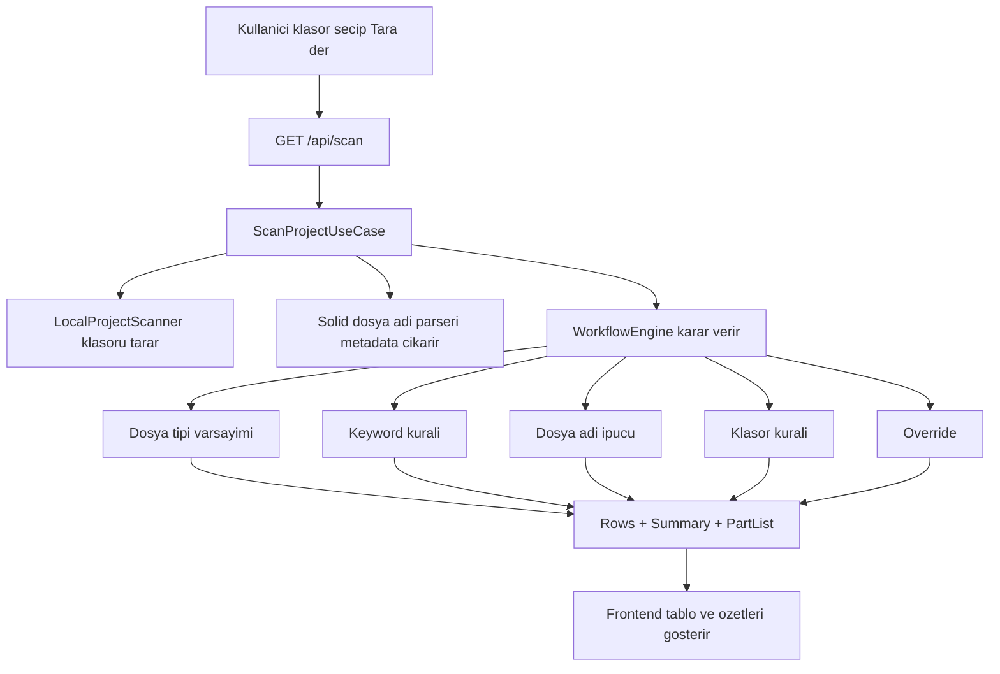
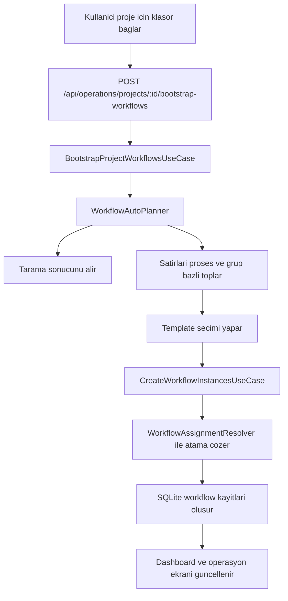
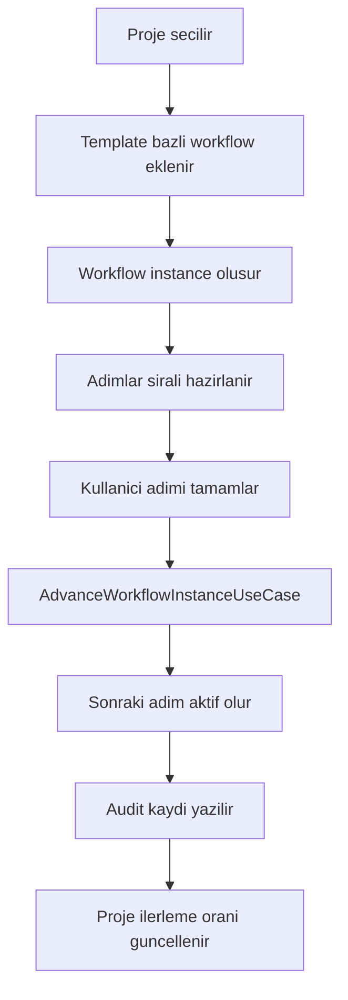
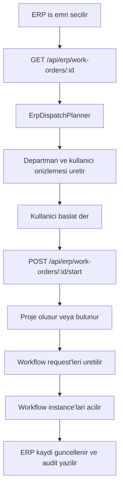
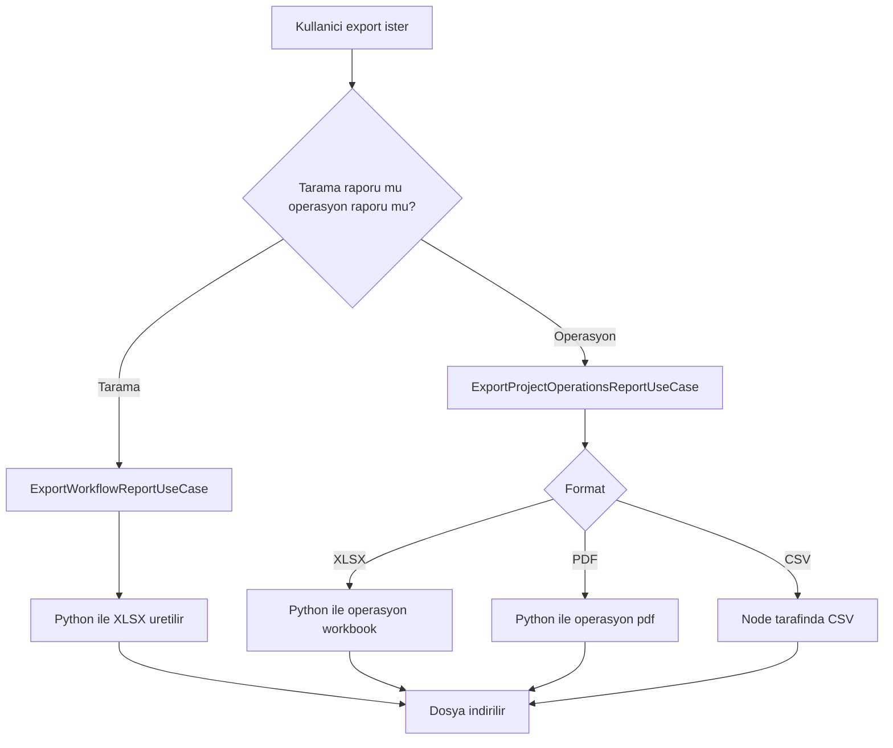

# Proje Gidis Yolu ve Akis Semasi

Bu dokuman, `SolidDosyaOkuma` projesinin bugunku durumunu, calisan ana akislarini ve ileride hangi sirayla buyutulmesi gerektigini tek yerde toplar.

Amac:
- Sistemin su an ne yaptigini netlestirmek
- Teknik ve operasyonel akislarin birbirine nasil baglandigini gostermek
- Sonraki gelisim adimlarini takip edilebilir hale getirmek

## 1. Projenin Cekirdek Amaci

Bu proje, SolidWorks kaynakli klasor ve dosya yapilarini okuyup operasyonel is akisina donusturen hafif bir MES ve workflow yonetim uygulamasidir.

Temel hedefler:
- Proje klasorunu taramak
- Dosyalari kural tabanli siniflandirmak
- Parca ve proses bilgisini cikarmak
- Gerekirse otomatik workflow uretmek
- Kullanici ve departmanlara is atamak
- Operasyonel sureci raporlamak

## 2. Bugun Calisan Islevler

### 2.1 Dosya Tarama ve Siniflandirma

Sistem su an:
- Verilen klasoru recursive tarar
- Sadece aktif dosya tipi kurallarinda tanimli uzantilari isler
- Dosya adindan `parca kodu`, `adet`, `revizyon`, `varyant`, `malzeme ipucu`, `proses ipucu` cikarmaya calisir
- Siniflandirma kararini asagidaki zincire gore verir:
  1. Manuel override
  2. Klasor kurali
  3. Dosya adi ayristirma ipucu
  4. Anahtar kelime kurali
  5. Dosya tipi varsayimi
  6. Belirsiz

Uretilen ciktilar:
- Satir bazli tarama listesi
- Ozet metrikler
- Birlesik parca listesi

### 2.2 Kural Yonetimi

Sistem su kurallari yonetebiliyor:
- Dosya tipi kurallari
- Anahtar kelime kurallari
- Parca override kurallari
- Assignment kurallari

Veri kaynaklari:
- Ana isletim verisi: `data/solid-workflow.db`
- Yonetilebilir konfigurasyon: `data/*.json`

### 2.3 Operasyon ve Workflow Yonetimi

Sistem su an:
- Kullanici ve departmanlari listeler
- Yeni kullanici ekler, pasife alir
- Proje olusturur ve siler
- Template bazli workflow instance olusturur
- Klasor tarama sonucundan otomatik workflow onerisi uretir
- Adimlara kullanici atamasi yapar
- Adim ilerletir, yeni adim ekler, adim gunceller
- Adim silindiginde kaydi `open_jobs` alanina tasir
- Audit olaylarini saklar ve listeler
- Proje bazli ilerleme yuzdesi hesaplar

### 2.4 ERP Onizleme ve Operasyon Baslatma

Sistem su an:
- ERP is emirlerini listeler
- Tek bir ERP is emrinin detayini ve dagitim onizlemesini gosterir
- Satirlari departman ve kullanici sinyalleriyle eslestirmeye calisir
- ERP is emrinden proje ve workflow uretebilir

Bu kisim su an tam entegrasyon degil, lokal veri tabanli bir operasyon baslatma altyapisidir.

### 2.5 Raporlama

Sistem su an:
- Tarama sonucunu `CSV` olarak verir
- Tarama sonucunu `Excel` olarak verir
- Proje operasyon raporunu `Excel`, `CSV`, `PDF` olarak verir

Rapor kapsaminda yer alanlar:
- Tarama ozetleri
- Workflow listeleri
- Workflow adimlari
- Acik isler
- Audit kayitlari

## 3. Uygulamanin Ana Modulleri

### 3.1 Backend

Backend ana sorumluluklari:
- HTTP API sunmak
- Tarama ve siniflandirma use-case'lerini calistirmak
- Workflow ve operasyon verisini yonetmek
- Rapor export akisini calistirmak

Katmanlar:
- `apps/backend/src/domain`
- `apps/backend/src/application`
- `apps/backend/src/infrastructure`
- `apps/backend/src/presentation`

### 3.2 Frontend

Frontend ana sorumluluklari:
- Tarama ekranlari
- Kural yonetim ekranlari
- Operasyon merkezi
- Kullanici calisma alani
- ERP ekranlari
- Rapor indirme akislarini tetiklemek

### 3.3 Veri Katmani

Veri katmani iki parcali calisiyor:
- SQLite: operasyonel ve kalici ana veri
- JSON: yonetilebilir kurallar ve seed verileri

## 4. Ana Is Akis Semalari

### 4.1 Dosya Tarama ve Siniflandirma Akisi

### 4.2 Klasorden Otomatik Workflow Uretme Akisi

### 4.3 Manuel veya Template Bazli Workflow Yonetimi

### 4.4 ERP Is Emrinden Operasyon Baslatma Akisi

### 4.5 Raporlama Akisi

## 5. Bugunku Sistem Sinirlari

Su alanlar su an var ama kisitli veya erken asamada:
- Dosya siniflandirma aciklanabilir ama kalite metrigi sistematik takip edilmiyor
- Belirsiz dosya listesi var, fakat kural etkisi analizi yok
- ERP akisi lokal veri uzerinden simule ediliyor, gercek entegrasyon degil
- Yetkilendirme ve oturum yonetimi yok
- Buyuk frontend davranisi tek dosyada toplu halde duruyor
- Arka plan isleri ve kuyruk yapisi yok
- Workflow otomasyonu iki template ve sinirli esleme kurali ile calisiyor

## 6. Projenin Ileride Yapmasi Gereken Islevler

Bu baslik, projeyi bugunku MVP+ durumundan guvenilir bir operasyon platformuna tasiyacak ana islevleri siralar.

### 6.1 En Kritik Kisa Vade Islevleri

1. Dosya adi parserini guclendirme
- Parca kodu, grup, proses, varyant, revizyon ve adet cikarma kalitesini artirma
- Klasor yolu ile dosya adini birlikte yorumlama
- Tahmin ile kesin karar ayrimini daha net hale getirme

2. Siniflandirma gozlenebilirligi
- Neden bu proses secildi ekranlarda daha acik gosterilmeli
- Belirsiz kalan dosyalar ayrica listelenmeli
- Hangi kuralin kac dosyayi etkiledigi raporlanmali

3. Kural etki analizi
- Yeni kural kaydedilince onceki tarama sonucuna etkisi gorulebilmeli
- Cakisali kural durumlari isaretlenmeli
- Fazla genel kurallar tespit edilebilmeli

4. Workflow otomasyon kalitesini artirma
- Daha fazla template tipi
- Birden fazla proses iceren parca aileleri icin daha iyi planlama
- Ana grup ve parca ailesine gore otomatik instance olusturma kalitesini artirma

### 6.2 Orta Vade Islevleri

1. Kural yonetimini tam UI destekli hale getirme
- Assignment kurallari da UI'dan yonetilebilmeli
- Workflow template yonetimi UI'dan yapilabilmeli
- Kural degisiklikleri versiyonlanmali

2. Operasyonel izlenebilirlik
- Belirsiz dosya raporu
- En cok override isteyen parcalar
- Yanlis siniflandirma tekrar listesi
- Proses bazli anomali gostergeleri

3. Gercek ERP entegrasyonuna hazirlik
- Lokal JSON yerine adapter tabanli ERP provider yapisi
- Import senkronizasyon kayitlari
- Hata, tekrar deneme ve audit zinciri

4. Kullanici yetki modeli
- Rol bazli erisim
- Adim bazli sorumluluk yetkisi
- Sadece ilgili departmanin mudahele edebilmesi

### 6.3 Uzun Vade Islevleri

1. Arka plan isleri ve kuyruk yapisi
- Buyuk klasor taramalarini queue uzerinden calistirma
- Raporlari arka planda olusturma
- ERP senkronizasyonunu zamanlanmis hale getirme

2. Gelismis arama ve filtreleme
- Parca kodu, proses, grup, revizyon, varyant bazli arama
- Audit ve open job kayitlarinda kapsamli filtreleme

3. Tahmin destekli karar yardimi
- Gecmis override'lara gore kural onerisi
- Belirsiz dosyalar icin aday proses siralamasi
- Yanlis pozitif kontrolu ile guven puani iyilestirmesi

4. Dijital uretim platformuna evrilme
- Barkod
- Gercek is emri akisi
- Istasyon bazli takip
- Durus, bekleme ve gecikme nedenleri

## 7. Onerilen Gelisim Sirasi

Bu proje icin en saglikli gelisim sirasi asagidaki gibidir.

### Faz 1: Siniflandirma Dogrulugu

Hedef:
- Dosyayi dogru anlamak

Yapilacaklar:
- Parser iyilestirme
- Kural oncelik zincirini sertlestirme
- Belirsiz dosya raporu
- `matchedBy` alanini zenginlestirme

Basari olcutleri:
- Belirsiz dosya sayisi azalir
- Override ihtiyaci azalir
- Yanlis siniflandirma tekrar sayisi azalir

### Faz 2: Gozlenebilirlik ve Yonetilebilirlik

Hedef:
- Sistem neden bu karari verdi sorusuna cevap verebilsin

Yapilacaklar:
- Kural etki analizi
- Rule diff veya once-sonra karsilastirma
- UI'da karar aciklamalari
- Assignment kurali yonetim ekrani

Basari olcutleri:
- Kural degisikligi sonrasi davranis gorulebilir olur
- Belirsizliklerin kaynagi hizli bulunur

### Faz 3: Workflow Otomasyon Derinligi

Hedef:
- Siniflandirma ciktisini gercekten kullanisli operasyonlara cevirmek

Yapilacaklar:
- Yeni workflow template tipleri
- Ana grup bazli planlama stratejileri
- Karma prosesli isler icin coklu akis mantigi

Basari olcutleri:
- Otomatik uretilen workflow kalitesi artar
- Manuel duzeltme azalir

### Faz 4: ERP ve Operasyon Entegrasyonu

Hedef:
- Dosya tarama ile operasyon kaydini ayni zincirde birlestirmek

Yapilacaklar:
- Adapter tabanli ERP baglantisi
- Is emri durum geri yazimi
- Senkronizasyon ve hata izleme

Basari olcutleri:
- ERP'den operasyona gecis daha az manuel adimla olur
- Veri cift girisi azalir

### Faz 5: Olceklenebilir Platformlasma

Hedef:
- Buyumeye uygun, siraya alinabilir, izlenebilir bir sistem

Yapilacaklar:
- Queue
- Arka plan job sistemi
- Gelismis audit ve arama
- Yetkilendirme

Basari olcutleri:
- Buyuk veri ve uzun sureli isler sistemde sorun yaratmaz
- Farkli ekipler ayni altyapiyi guvenle kullanir

## 8. Takip Tablosu

Asagidaki tablo dokumanin canli takip bolumu olarak kullanilabilir.

| Alan | Bugunku Durum | Hedef Durum | Oncelik |
|---|---|---|---|
| Dosya tarama | Calisiyor | Buyuk klasorlerde daha guvenilir ve olcekli | Yuksek |
| Dosya adi parseri | Temel metadata cikariyor | Daha dogru ve alan bazli parser | Yuksek |
| Kural motoru | Calisiyor | Etki analizi ve aciklama katmani guclu | Yuksek |
| Workflow otomasyonu | Sinirli template tabanli | Zengin ve duruma ozel planlama | Yuksek |
| Kullanici atama | Kural tabanli temel atama | Yetkili ve akilli atama | Orta |
| ERP | Lokal simulasyon ve baslatma | Gercek entegrasyon | Orta |
| Raporlama | CSV/XLSX/PDF var | Arka plan ve zamanlanabilir raporlama | Orta |
| Yetkilendirme | Yok | Rol bazli erisim | Orta |
| Gozlenebilirlik | Kismen var | Kural etkisi ve kalite panolari | Yuksek |
| Frontend modulerlik | Dusuk | Daha parcali ve surdurulebilir | Orta |

## 9. Sonuc

Bu proje artik basit bir dosya listeleme aracindan cikmis durumda. Su an:
- dosya tarayabiliyor
- siniflandirabiliyor
- workflow uretebiliyor
- kullaniciya atama yapabiliyor
- operasyonu izleyebiliyor
- rapor uretebiliyor

Ancak projeyi gercek deger ureten bir operasyon platformuna tasiyacak ana alan, dogru ve aciklanabilir siniflandirma motorunun guclenmesidir. En dogru gelisim yolu:
- once dosyayi daha iyi anlamak
- sonra kural motorunu gozlenebilir yapmak
- sonra workflow otomasyonunu derinlestirmek
- en son ERP ve platformlasma katmanini buyutmektir

## Mevcut Durum Raporu
- Tamamlanan Adim: Projenin bugunku kapsami, akis semalari ve yol haritasi tek bir takip dokumaninda toplandi.
- Bir Sonraki Adim: Bu dokumana gore ilk uygulama fazi olarak siniflandirma dogrulugu ve gozlenebilirlik backlog'unu cikarmak.
- Neden Bu Adim: Projenin sonraki teknik yatirimi, siniflandirma kalitesi netlesmeden yapilirsa workflow otomasyonu ve ERP tarafinda hatali zincirler olusur.
